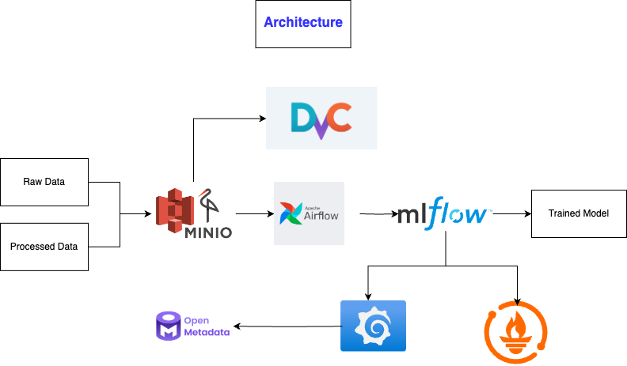

README.md

# Credit Card Fraud Detection with MLOps

This project demonstrates an end-to-end Machine Learning pipeline for Credit Card Fraud Detection, leveraging MLOps tools and best practices. It incorporates DVC, MLflow, Airflow, OpenMetadata, Prometheus, Grafana, and MinIO to manage the entire lifecycle of data, models, and infrastructure.

---

## Table of Contents

1. [Project Overview](#project-overview)
2. [Features](#Features)
3. [Architecture](#Architecture)
4. [Setup Instructions](#Setup_Instructions)
5. [Usage](#Usage)
6. [Project Structure](#Project_Structure)
7. [Monitoring and Alerts](#Monitoring_and_Alerts)
8. [Troubleshooting](#Troubleshooting)
9. [Contributing](#Contributing)

---

## Project Overview

Credit card fraud detection is a critical task in the financial domain. This project demonstrates a production-ready pipeline that:

- Processes raw transactional data.
- Performs feature engineering and model training.
- Tracks experiments and metadata.
- Monitors data and model drift.

The system is built with scalability and reproducibility in mind, using tools such as DVC for data versioning, MLflow for experiment tracking, and Airflow for pipeline orchestration.

---

## Features

- Data Versioning: Manage raw and processed datasets using DVC.
- Pipeline Orchestration: Automate workflows with Airflow and DVC - pipelines.
- Experiment Tracking: Log model training runs, metrics, and artifacts - with MLflow.
- Metadata Management: Track dataset and model lineage using - OpenMetadata.
- Monitoring: Visualize metrics in Grafana and monitor health with - Prometheus.
- Cloud Storage: Store datasets in MinIO, an S3-compatible storage - solution.
- Deployment-Ready: Supports deployment via Docker and Kubernetes.

---

### Architecture

The architecture consists of the following components:



## Setup Instructions

### 1. Prerequisites

- Docker and Docker Compose installed.
- Kubernetes (optional) for cluster deployment.

### 2. Clone the Repository

```
git clone https://github.com/your-repo/fraud-detection-mlops.git
cd fraud-detection-mlops
```

### 3. Build and Run Docker Compose

Build and start all services using Docker Compose:

```
docker-compose up -d
```

### 4. Access Services

| Service       | URL                   | Notes                          |
| ------------- | --------------------- | ------------------------------ |
| MinIO Console | http://localhost:9001 | Manage raw and processed data. |
| Prometheus    | http://localhost:9090 | Monitor metrics and alerts.    |
| Grafana       | http://localhost:3000 | Visualize dashboards.          |
| Airflow       | http://localhost:8080 | Orchestrate workflows.         |
| OpenMetadata  | http://localhost:8585 | Manage metadata.               |

---

## Usage

### 1. Data Versioning with DVC

Add, version, and push raw data:

```
dvc init
dvc add data/raw/creditcard_2023.csv
dvc remote add -d minio s3://dvc-bucket
dvc push
```

### 2. Run Pipelines

- DVC Pipeline:

```
dvc repro
```

- Airflow DAG:
  Enable and trigger the fraud_detection_dag from the Airflow UI.

### 3. Monitor Metrics

- Open Grafana and import dashboards for MinIO, MLflow, and custom model metrics.
- Use Prometheus to query raw metrics.

---

## Project Structure

```
.
├── Architecture.png
├── Dockerfile
├── README.md
├── SECURITY.md
├── Untitled Diagram.drawio
├── airflow
│   ├── airflow.cfg
│   └── dags
│       └── airflow_dvc_mlflow_dag.py
├── config
│   └── global_config.yml
├── data
│   ├── dvc.yml
│   ├── processed
│   └── raw
│       └── creditcard_2023.csv
├── docker-compose.yml
├── generate_tree.sh
├── get-pip.py
├── k8s
│   ├── airflow
│   │   └── airflow-deployment.yaml
│   ├── grafana
│   │   └── grafana-deployment.yaml
│   ├── minio
│   │   └── minio-deployment.yaml
│   ├── openmetadata
│   │   └── openmetadata-deployment.yaml
│   └── prometheus
│       ├── prometheus-deployment.yaml
│       └── prometheus.yml
├── logs
├── openmetadata
│   ├── __init__.py
│   ├── config.yaml
│   ├── metadata_pipeline.py
│   └── schemas
│       ├── data_schema.yaml
│       └── model_schema.yaml
├── plugins
├── project_structure.md
├── pytest.ini
├── requirements-2.txt
├── requirements.txt
├── src
│   ├── __init__.py
│   ├── data_preprocessing
│   │   ├── __init__.py
│   │   ├── feature_engineering.py
│   │   └── preprocessing.py
│   ├── models
│   │   ├── __init__.py
│   │   ├── evaluate.py
│   │   ├── predict.py
│   │   └── train.py
│   ├── monitoring
│   │   ├── __init__.py
│   │   ├── data_drift.py
│   │   └── model_drift.py
│   ├── pipelines
│   │   ├── __init__.py
│   │   ├── dvc_pipeline.py
│   │   ├── mlflow_pipeline.py
│   │   └── pipeline_config.yml
│   └── utils.py
├── supervisord.conf
└── tests
    ├── conftest.py
    ├── test_data_preprocessing.py
    ├── test_drift_detection.py
    ├── test_models.py
    └── test_pipelines.py
```

## Monitoring and Alerts

### 1. Prometheus

- Scrape metrics from MinIO, OpenMetadata, and application components.
- Alert Rules:
- MinIO Down: Triggered if MinIO is unreachable for over 1 minute.

### 2. Grafana Dashboards

- Import pre-built dashboards:
- MinIO: Grafana Dashboard for MinIO
- MLflow and custom metrics.

## Troubleshooting

### 1.  Service Not Starting:

- Check logs:

```
docker logs <container_name>
```

### 2. Data Not Found in MinIO:

- Verify dvc remote settings and MinIO credentials.

### 3.  Prometheus Target Down:

- Ensure the service is accessible from Prometheus.

## Contributing

Contributions are welcome! Please follow these steps:

1. Fork the repository.
2. Create a feature branch:

```
git checkout -b feature/new-feature
```

3. Commit your changes and create a pull request.
